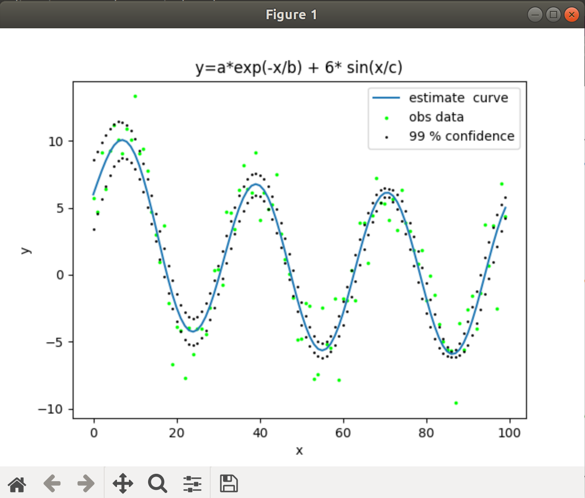

# Non-Linear Optimization Study

一个非常简单的非线性优化求解器.

实现参考资料
- Methods for Non-Linear Least Squares Problems (2nd ed.)
- The Levenberg-Marquardt algorithm for nonlinear least squares curve-fitting problems

包含如下求解方法
- 高斯牛顿法
- LM法
- Dog-Leg法

依赖
- C++11
- Eigen 

待完善
- [ ] 加入外点和鲁棒核函数测试

以曲线拟合为例子,结果如下所示:

 

|     | param_init   | param_true   | param_esti | sigama_p |
| --- | ------------ | ------------ | ------------ | ---------- |
| a | 10.0           | 6            |       6.00206       |     0.868862       |
| b | 50.0           | 20           |       19.151       |   4.03159         |
| c | 5.7            | 1            |       4.99278       |   0.0199173         |

